## Adding company in the client tool mysql(same with mariadb) and the Windows installer
- This document assumes the company name as ADS. 
- Source code update
```
> client tool : 
  - FILE : $SrcRoot/client/mysql.cc
  - FROM : put_info("Welcome to the MariaDB monitor.  Commands end with ; or \\g."
  - TO   : put_info("Welcome to the MariaDB monitor by ADS.  Commands end with ; or \\g."

> Windows installer
  - FILE : $SrcRoot/win/packaging/CMakeLists.txt
  - FROM : SET(CPACK_WIX_PACKAGE_NAME "MariaDB ${MAJOR_VERSION}.${MINOR_VERSION}")
  - TO   : SET(CPACK_WIX_PACKAGE_NAME "MariaDB ${MAJOR_VERSION}.${MINOR_VERSION} by ADS")
  - FROM : SET(CPACK_WIX_PACKAGE_NAME "MariaDB ${MAJOR_VERSION}.${MINOR_VERSION} (${WIX_ARCH})")
  - TO   : SET(CPACK_WIX_PACKAGE_NAME "MariaDB ${MAJOR_VERSION}.${MINOR_VERSION} by ADS (${WIX_ARCH})")
```

## Building MariaDB from source
- Reference
  - https://mariadb.org/get-involved/getting-started-for-developers/get-code-build-test/
  - https://mariadb.com/kb/en/get-build-and-test-latest-mariadb-the-lazy-way/
  - https://mariadb.com/kb/en/Building_MariaDB_on_Windows/
- Linux MariaDB build
  - I built MariaDB using Ubuntu 22.04.1 LTS and there was no problem.
- Windows MariaDB build
  - I built MariaDB using Windows 10 and Visual Studio 2022 Community Edition and there were some precautions.
  - Recommend using "Developer Command Prompt for Visual Studio" instead of normal Command Prompt.
  - Change system locale to "English(United States)" in control panel.
    - Otherwise, you cannot build MariaDB because of the warning C4819 (The file contains a character that cannot be represented in the current code page)
  - Installer build example : cmake --build . --config relwithdebinfo --target MSI

## client tool screen capture
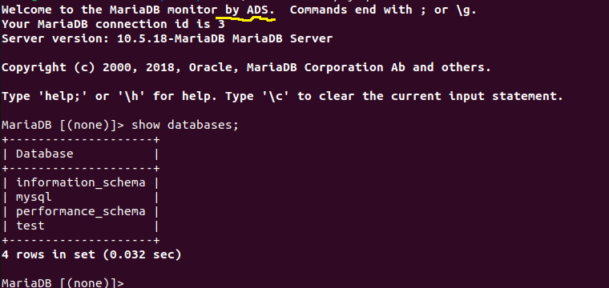

## Windows Install screen capture
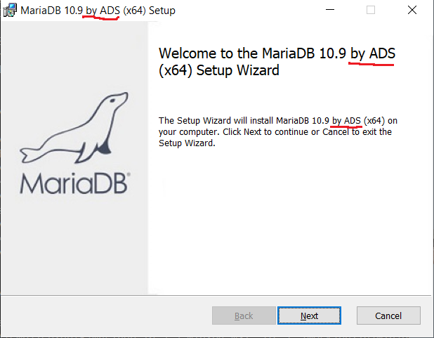
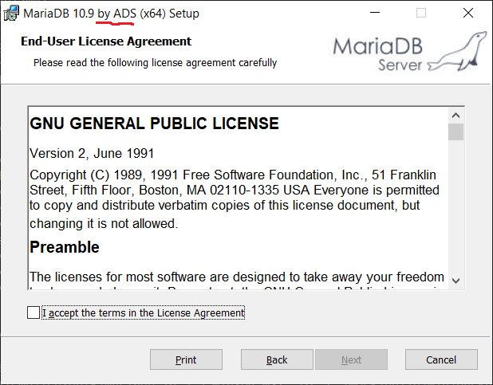
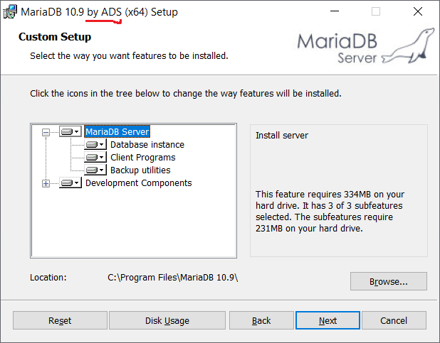
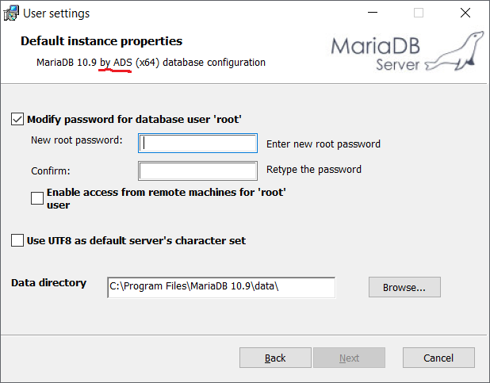
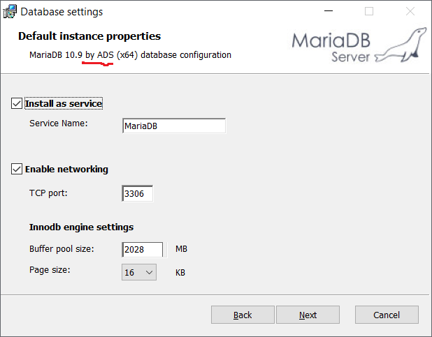
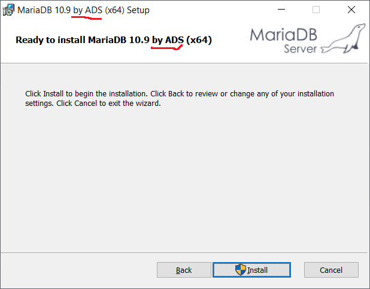
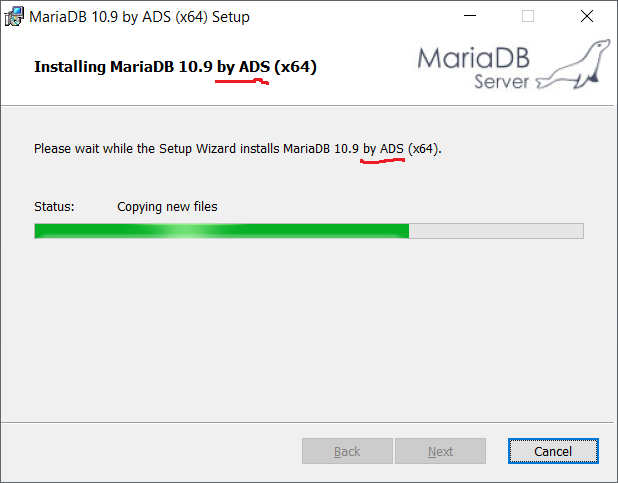
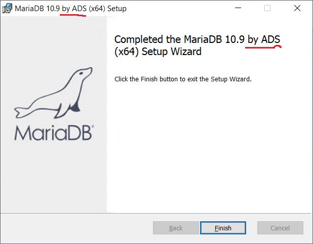

## Windows Uninstall screen capture
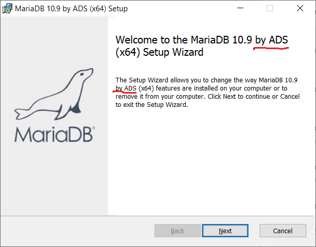
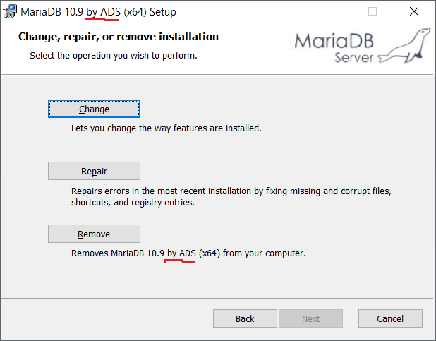
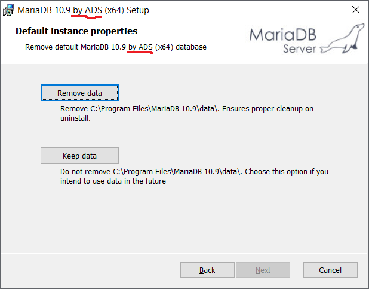
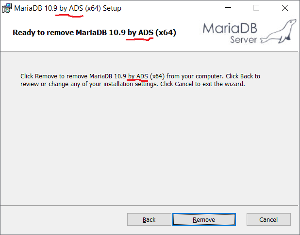
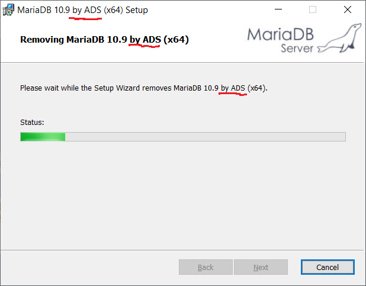
